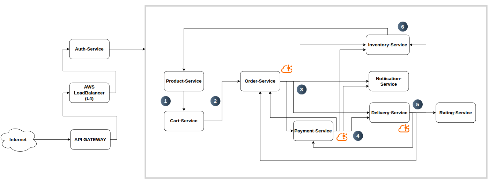
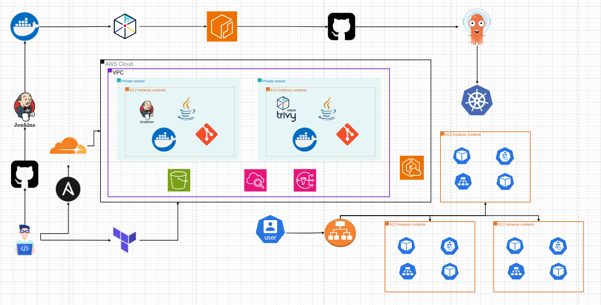

# E-commerce Microservices Monorepo

A comprehensive e-commerce platform built with **distributed microservices architecture**, featuring **event-driven communication** via Kafka, **Saga pattern** for distributed transactions, and **Redis caching** for high-performance inventory management.


*Saga Pattern: Order creation flow with inventory check, payment, and delivery orchestration*


*CI/CD Pipeline: Jenkins, Docker Registry, and Kubernetes deployment workflow*

---

## Table of Contents

- [Architecture Overview](#architecture-overview)
- [Microservices](#microservices)
- [Technology Stack](#technology-stack)
- [Project Structure](#project-structure)
- [Getting Started](#getting-started)
- [Development Guide](#development-guide)
- [Deployment](#deployment)
- [License](#license)

---

## Architecture Overview

```
┌─────────────────────────────────────────────────────────────────────────────┐
│                           CLIENT LAYER                                      │
│  ┌─────────────┐                                                            │
│  │  React App  │  (Vite + TypeScript)                                       │
│  └──────┬──────┘                                                            │
└─────────┼───────────────────────────────────────────────────────────────────┘
          │
          ▼
┌─────────────────────────────────────────────────────────────────────────────┐
│                         API GATEWAY / LOAD BALANCER                         │
│                    (Nginx / Kubernetes Ingress)                               │
└─────────────────────────────────────────────────────────────────────────────┘
          │
          ▼
┌─────────────────────────────────────────────────────────────────────────────┐
│                      MICROSERVICES LAYER                                    │
│                                                                             │
│  ┌──────────┐ ┌──────────┐ ┌──────────┐ ┌──────────┐ ┌──────────┐          │
│  │  Auth    │ │ Product  │ │  Order   │ │   Cart   │ │ Inventory│          │
│  │ Service  │ │ Service  │ │ Service  │ │ Service  │ │ Service  │          │
│  │  :3001   │ │  :3002   │ │  :3003   │ │  :3004   │ │  :3005   │          │
│  └────┬─────┘ └────┬─────┘ └────┬─────┘ └────┬─────┘ └────┬─────┘          │
│       │            │            │            │            │               │
│  ┌──────────┐ ┌──────────┐ ┌──────────┐                                     │
│  │ Delivery │ │  Rating  │ │ Payment  │                                     │
│  │ Service  │ │ Service  │ │ Service  │                                     │
│  │  :3006   │ │  :3007   │ │  :3008   │                                     │
│  └────┬─────┘ └──────────┘ └────┬─────┘                                     │
│       │                          │                                          │
└───────┼──────────────────────────┼──────────────────────────────────────────┘
        │                          │
        │    ┌─────────────────────┘
        │    │
        ▼    ▼
┌─────────────────────────────────────────────────────────────────────────────┐
│                      MESSAGE BROKER (Kafka)                                 │
│                                                                             │
│   ┌──────────────┐    ┌──────────────┐    ┌──────────────────────────┐    │
│   │   kafka-1    │◄──►│   kafka-2    │    │     kafka-connect        │    │
│   │   :9092      │    │   :9093      │    │     (Debezium CDC)       │    │
│   └──────────────┘    └──────────────┘    └──────────────────────────┘    │
│          ▲                                               │                   │
│     ┌────┴────┐                                         │ CDC              │
│     │Zookeeper│                                         ▼                  │
│     │  :2181  │                              ┌───────────────────┐         │
│     └─────────┘                              │  PostgreSQL DBs   │         │
│                                              │  (wal_level=logical)       │
│                                              └───────────────────┘         │
│                                                                             │
│   Topics: order-events, payment-events, delivery-events,                   │
│           inventory-events, product-events                                   │
└─────────────────────────────────────────────────────────────────────────────┘
          │
          ▼
┌─────────────────────────────────────────────────────────────────────────────┐
│                      DATA LAYER                                             │
│                                                                             │
│   ┌──────────┐  ┌──────────┐  ┌──────────┐  ┌──────────┐  ┌──────────┐     │
│   │  auth-db │  │product-db│  │ order-db │  │  cart-db │  │inventory-│     │
│   │  :5434   │  │  :5435   │  │  :5436   │  │  :5437   │  │   db     │     │
│   └──────────┘  └──────────┘  └──────────┘  └──────────┘  │  :5438   │     │
│                                                           └──────────┘     │
│   ┌──────────┐  ┌──────────┐  ┌──────────┐                                 │
│   │delivery- │  │ rating-  │  │ payment- │  ┌──────────┐                    │
│   │  db      │  │   db     │  │   db     │  │  Redis   │                    │
│   │  :5439   │  │  :5440   │  │  :5441   │  │  :6379   │  (Inventory Cache) │
│   └──────────┘  └──────────┘  └──────────┘  └──────────┘                    │
└─────────────────────────────────────────────────────────────────────────────┘
```

---

## Microservices

| Service | Port | Database | Redis | Kafka | Description |
|---------|------|----------|-------|-------|-------------|
| **Auth Service** | 3001 | auth-db | - | - | JWT authentication, user management |
| **Product Service** | 3002 | product-db | - | ✅ | Product catalog, categories |
| **Order Service** | 3003 | order-db | - | ✅ | Order processing, orchestration |
| **Cart Service** | 3004 | cart-db | - | - | Shopping cart management |
| **Inventory Service** | 3005 | inventory-db | ✅ | ✅ | Stock management, reservation |
| **Delivery Service** | 3006 | delivery-db | - | ✅ | Shipping, delivery tracking |
| **Rating Service** | 3007 | rating-db | - | ✅ | Product reviews, ratings |
| **Payment Service** | 3008 | payment-db | - | ✅ | VNPay integration |

### Key Features

- **🔐 Auth Service**: JWT-based authentication, user registration/login
- **📦 Product Service**: Product CRUD, categories, search integration
- **🛒 Order Service**: Order creation, Saga pattern, inventory pre-check
- **🛍️ Cart Service**: Persistent shopping cart per user
- **📊 Inventory Service**: Real-time stock with Redis cache, atomic reservation via Lua scripts
- **🚚 Delivery Service**: Delivery status tracking, courier assignment
- **⭐ Rating Service**: Product reviews with moderation
- **💳 Payment Service**: VNPay sandbox integration, payment callbacks

---

## Technology Stack

### Backend
- **Node.js** 20+ with **TypeScript**
- **Express.js** / **Fastify** (REST API)
- **Prisma ORM** (Database management)
- **JWT** (Authentication)

### Frontend
- **React** 19 with **TypeScript**
- **Vite** (Build tool)
- Modern ES2022+ features

### Infrastructure
- **Kafka** 3.5+ (Event streaming, 2 brokers for HA)
- **Zookeeper** (Kafka coordination)
- **Debezium** (Change Data Capture from PostgreSQL)
- **Redis** 7+ (Inventory caching)

### Databases
- **PostgreSQL** 15 (Per-service database, WAL logical for CDC)
- Each service owns its database (Database-per-service pattern)

### DevOps & Deployment
- **Docker** + **Docker Compose** (Local development)
- **Kubernetes** (Container orchestration)
- **ArgoCD** (GitOps continuous delivery)
- **Jenkins** (CI/CD pipelines)
- **Terraform** (Infrastructure as Code)
- **Ansible** (Configuration management)

---

## Project Structure

```
web2-e-commerce-microservices-monorepo/
├── back/                           # Backend microservices
│   ├── auth-service/               # Authentication (Port 3001)
│   ├── product-service/            # Product catalog (Port 3002)
│   ├── order-service/              # Order processing (Port 3003)
│   ├── cart-service/               # Shopping cart (Port 3004)
│   ├── inventory-service/          # Stock management (Port 3005)
│   ├── delivery-service/           # Shipping (Port 3006)
│   ├── rating-service/             # Reviews (Port 3007)
│   └── payment-service/            # VNPay integration (Port 3008)
│
├── front/                          # React frontend (Vite)
│   ├── src/
│   ├── public/                     # Diagrams & assets
│   └── package.json
│
├── devops/                         # DevOps configurations
│   ├── k8s/                        # Kubernetes manifests
│   ├── terraform/                  # Infrastructure as Code
│   ├── ansible/                    # Server configuration
│   ├── argocd/                     # GitOps application configs
│   └── Jenkinsfile                 # CI/CD pipeline
│
├── connectors/                     # Debezium connector configs
├── scripts/                        # Helper scripts
├── docker-compose.yml              # Local orchestration
└── README.markdown                 # This file
```

---

## Getting Started

### Prerequisites

- **Docker** 24.0+ and **Docker Compose** 2.0+
- **Node.js** 20+ (for local development)
- **pnpm** or **npm**

```bash
# Verify installations
docker --version
docker-compose --version
node --version
```

### Quick Start

```bash
# 1. Clone repository
git clone https://github.com/kientt265/web2-e-commerce-microservices-monorepo.git
cd web2-e-commerce-microservices-monorepo

# 2. Create environment file
cp .env.example .env
# Edit .env with your configurations

# 3. Start all services
docker-compose up --build -d

# 4. Register Debezium connectors
./scripts/register-connector.sh

# 5. Verify services
docker ps
```

### Service Ports

| Service | External Port | Internal Port | Database Port |
|---------|--------------|---------------|---------------|
| Auth Service | 3001 | 3001 | 5434 |
| Product Service | 3002 | 3001 | 5435 |
| Order Service | 3003 | 3001 | 5436 |
| Cart Service | 3004 | 3001 | 5437 |
| Inventory Service | 3005 | 3001 | 5438 |
| Delivery Service | 3006 | 3001 | 5439 |
| Rating Service | 3007 | 3001 | 5440 |
| Payment Service | 3008 | 3001 | 5441 |
| Kafka Broker 1 | 9092 | 9092 | - |
| Kafka Broker 2 | 9093 | 9092 | - |
| Zookeeper | 2181 | 2181 | - |
| Redis | 6379 | 6379 | - |

---

## Development Guide

### Running Individual Services

```bash
# Start only infrastructure
docker-compose up -d zookeeper kafka-1 kafka-2 redis

# Start a specific service
docker-compose up -d order-service

# View logs
docker-compose logs -f order-service
```

### Database Migrations

```bash
# Run migrations for a service
cd back/order-service
npx prisma migrate dev

# Generate Prisma client
npx prisma generate
```

### Kafka Topics

The following topics are used for inter-service communication:

| Topic | Producer | Consumers | Purpose |
|-------|----------|-----------|---------|
| `order-events` | Order Service | Inventory, Payment, Delivery | Order lifecycle |
| `payment-events` | Payment Service | Order Service | Payment status |
| `delivery-events` | Delivery Service | Order, Inventory | Shipping updates |
| `product-events` | Product Service | Search, Inventory | Product changes |

### Inventory Flow (Redis + Saga)

```
1. Order Service calls Inventory API
   POST /inventories/product/{idd}/reserve

2. Inventory Service (Lua script - atomic):
   - Check stock in Redis
   - Reserve if available
   - Update DB (reserved_checkout, quantity)

3. Order creation proceeds

4. On payment success:
   - reserved_checkout → reserved_shipping

5. On delivery success:
   - reserved_shipping decremented

6. On failure/cancellation:
   - Release stock back to Redis & DB
```

---

## Deployment

### Docker Compose (Local/Staging)

```bash
# Production mode (no dev volumes)
docker-compose -f docker-compose.yml up -d

# With logging stack
docker-compose -f docker-compose.yml -f docker-compose.logging.yml up -d
```

### Kubernetes (Production)

```bash
# Apply manifests
cd devops/k8s
kubectl apply -f namespace.yaml
kubectl apply -f configmaps/
kubectl apply -f secrets/
kubectl apply -f deployments/
kubectl apply -f services/
kubectl apply -f ingress/

# Verify
kubectl get pods -n e-commerce
```

### ArgoCD (GitOps)

```bash
# Apply ArgoCD application
kubectl apply -f devops/argocd/application.yaml

# Sync via UI or CLI
argocd app sync e-commerce
```

### Terraform (Infrastructure)

```bash
cd devops/terraform
terraform init
terraform plan
terraform apply
```

---

## Architecture Patterns

### 1. Database Per Service
Each microservice owns its private database, ensuring loose coupling and independent scaling.

### 2. Saga Pattern (Orchestration)
Order Service orchestrates distributed transactions:
- Reserve inventory → Create order → Process payment → Ship
- On failure: Compensating transactions (release stock, cancel order)

### 3. CQRS with CDC
- **Command**: Write to PostgreSQL
- **Query**: Read from Elasticsearch (via Debezium CDC)

### 4. Cache-Aside with Redis
Inventory Service uses Redis for hot stock data:
- Read from cache, fallback to DB
- Write-through to both cache and DB
- Lua scripts for atomic operations

### 5. Event-Driven Architecture
Services communicate via Kafka:
- Async processing
- Event sourcing
- Loose coupling

---

## Monitoring & Observability

### Health Checks

```bash
# Service health
curl http://localhost:3001/health
curl http://localhost:3005/health

# Kafka health
kafka-broker-api-versions.sh --bootstrap-server localhost:9092
```

### Logging

- **Structured JSON logs** from all services
- **Centralized logging** via ELK/Loki
- **Correlation IDs** for distributed tracing

---

## API Documentation

### Auth Service (3001)
```
POST   /auth/register
POST   /auth/login
POST   /auth/refresh
GET    /auth/me
```

### Product Service (3002)
```
GET    /products
GET    /products/:id
POST   /products
PUT    /products/:id
DELETE /products/:id
```

### Order Service (3003)
```
POST   /orders              # Creates order with inventory check
GET    /orders/:id
GET    /orders/user/:userId
GET    /orders/:id/status
```

### Inventory Service (3005)
```
POST   /inventories/product/:productId/reserve  # Redis-based
POST   /inventories/product/:productId/release  # Rollback
GET    /inventories/product/:productId
```

---

## Contributing

1. Fork the repository
2. Create feature branch: `git checkout -b feature/amazing-feature`
3. Commit changes: `git commit -m 'Add amazing feature'`
4. Push to branch: `git push origin feature/amazing-feature`
5. Open Pull Request

See [CONTRIBUTING.md](./CONTRIBUTING.md) for details.

---

## License

This project is licensed under the MIT License.

---

## Acknowledgements

- [Apache Kafka](https://kafka.apache.org/)
- [Debezium](https://debezium.io/)
- [Prisma](https://www.prisma.io/)
- [VNPay](https://vnpay.vn/)
- [Kubernetes](https://kubernetes.io/)
- [ArgoCD](https://argo-cd.readthedocs.io/)
